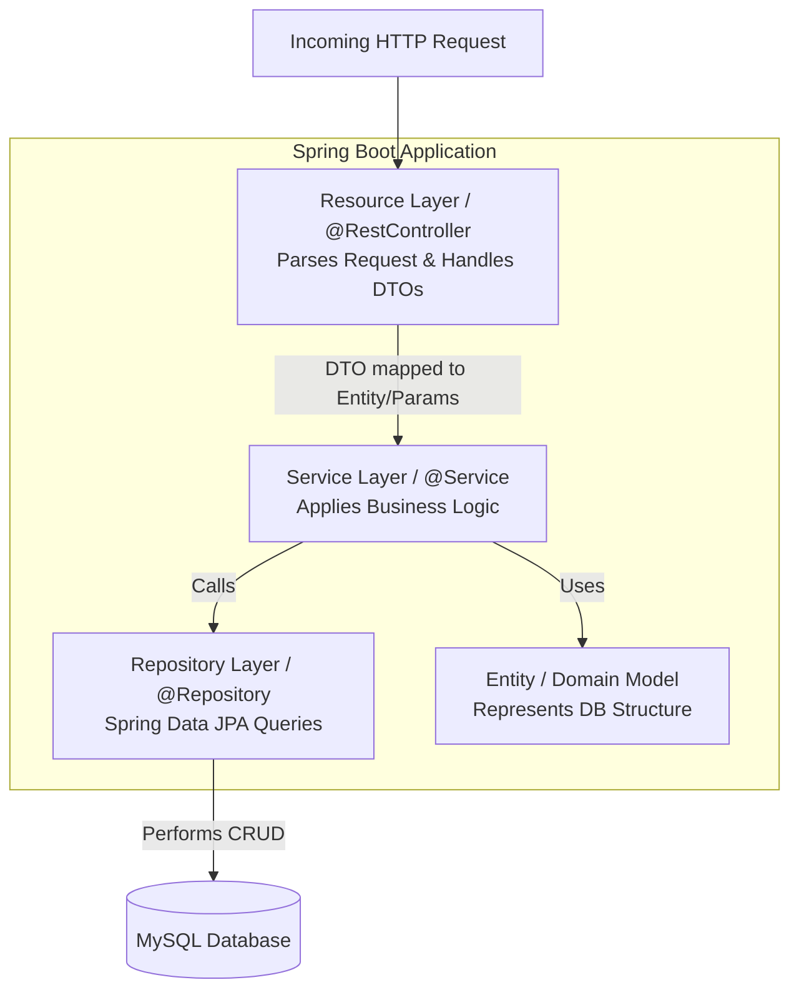
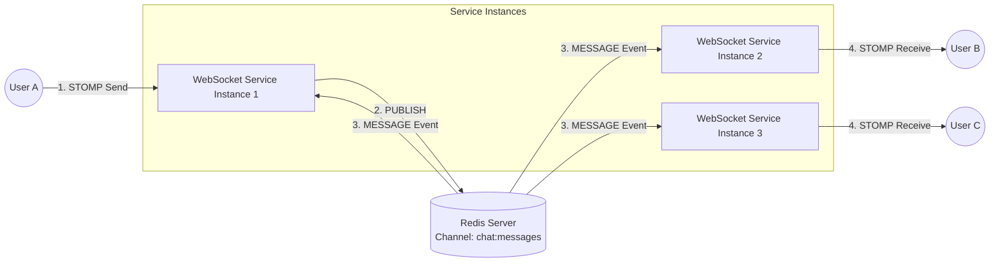

# ConnectHub Architecture Diagrams

This document illustrates the high-level architecture of the ConnectHub microservices platform.

## 1. System Service Architecture

The following diagram illustrates how the 9 Spring Boot microservices communicate with each other, the Gateway, Discovery Server, databases, and external services.

```mermaid
graph TD
    %% Clients
    Browser["Browser / Mobile Client"]

    %% Gateway & Registry
    Gateway["API Gateway :8080<br>Rate Limiting, JWT Validation"]
    Eureka["Service Registry :8761<br>Eureka"]

    %% Databases & External
    Redis[("Redis<br>Pub/Sub, TTL, Cache")]
    S3[("AWS S3<br>File Storage")]
    Kafka[("Apache Kafka<br>Event Bus")]

    %% Services
    subgraph Microservices
        Auth["Auth Service :8081<br>Users, JWT"]
        Room["Room Service :8082<br>Groups, Members"]
        Message["Message Service :8083<br>Chats, Reactions"]
        Media["Media Service :8084<br>File Uploads"]
        Presence["Presence Service :8085<br>Online Status"]
        Notification["Notification Service :8086<br>Emails, Alerts"]
        WebSocket["WebSocket Service :8087<br>Real-time STOMP"]
        Payment["Payment Service :8088<br>Subscriptions"]
    end

    %% Service DBs
    DBAuth[("MySQL Auth")]
    DBRoom[("MySQL Room")]
    DBMsg[("MySQL Message")]
    DBMedia[("MySQL Media")]
    DBNotif[("MySQL Notification")]

    %% Connections
    Browser -->|HTTP/REST| Gateway
    Browser -->|WebSocket/STOMP| Gateway
    
    Gateway -.->|Lookup| Eureka
    Auth -.->|Register| Eureka
    Room -.->|Register| Eureka
    Message -.->|Register| Eureka
    Media -.->|Register| Eureka
    Presence -.->|Register| Eureka
    Notification -.->|Register| Eureka
    WebSocket -.->|Register| Eureka
    Payment -.->|Register| Eureka

    Gateway -->|/api/v1/auth/**| Auth
    Gateway -->|/api/v1/rooms/**| Room
    Gateway -->|/api/v1/messages/**| Message
    Gateway -->|/api/v1/media/**| Media
    Gateway -->|/api/v1/presence/**| Presence
    Gateway -->|/api/v1/notifications/**| Notification
    Gateway -->|/ws/**| WebSocket
    Gateway -->|/api/v1/payments/**| Payment

    %% Service to DB
    Auth --> DBAuth
    Room --> DBRoom
    Message --> DBMsg
    Media --> DBMedia
    Media --> S3
    Notification --> DBNotif

    %% Redis Connections
    Auth -->|OTP, Blacklist| Redis
    Presence -->|Online Status| Redis
    Notification -->|Sub: email:send| Redis
    WebSocket -->|Pub/Sub chat:*| Redis
    Gateway -->|Rate Limit| Redis

    %% Kafka Connections
    WebSocket -->|Produce persist msg| Kafka
    Message -->|Consume persist msg| Kafka
    Payment -->|Produce subscription ev| Kafka
    Notification -->|Consume alerts| Kafka
```

## 2. Microservice Layered Architecture Pattern

This diagram represents the typical internal pattern used across all ConnectHub services.

## 3. WebSocket Multi-Instance Cross-Broadcast

This architecture diagram demonstrates how messages efficiently reach all users even when WebSocket services scale horizontally.

