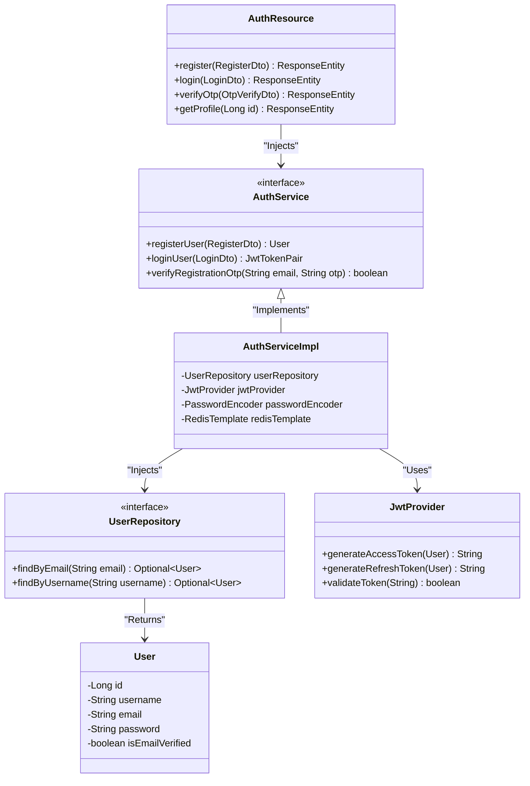
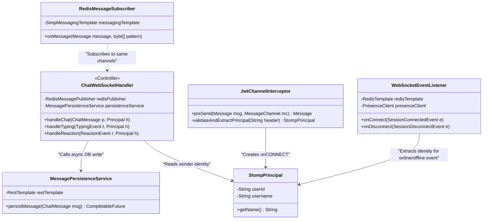

# ConnectHub Class Diagrams

These class diagrams represent the general structure of our REST services and the specific setup for our real-time WebSocket communication engine.

## 1. Typical Microservice REST Structure

This diagram outlines the typical Java class relationship for almost any domain in ConnectHub (using `auth-service` as the example).

## 2. WebSocket Real-Time Engine Details

This outlines the WebSocket-Service structure displaying how the JWT Authentication, Presence tracking, and generic Chat handling intertwines.

