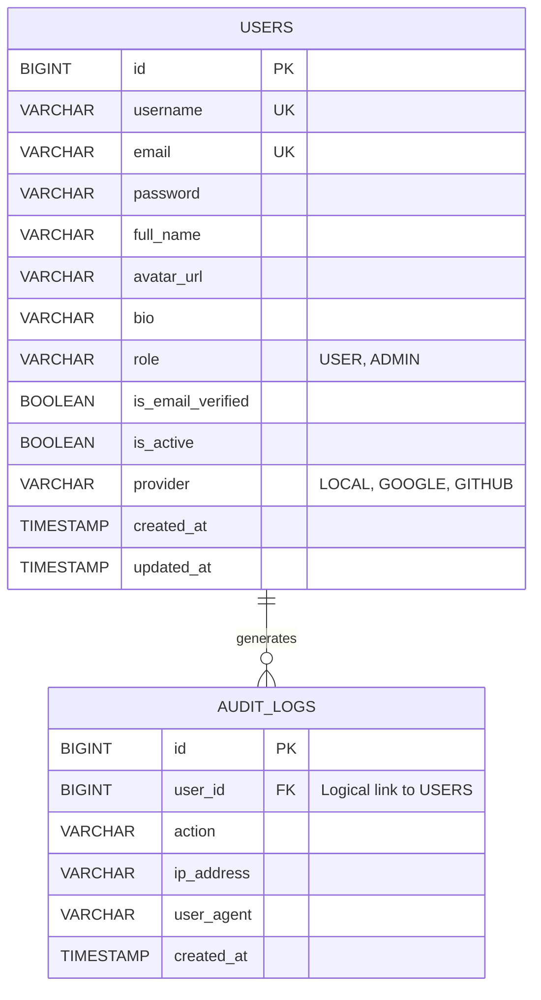
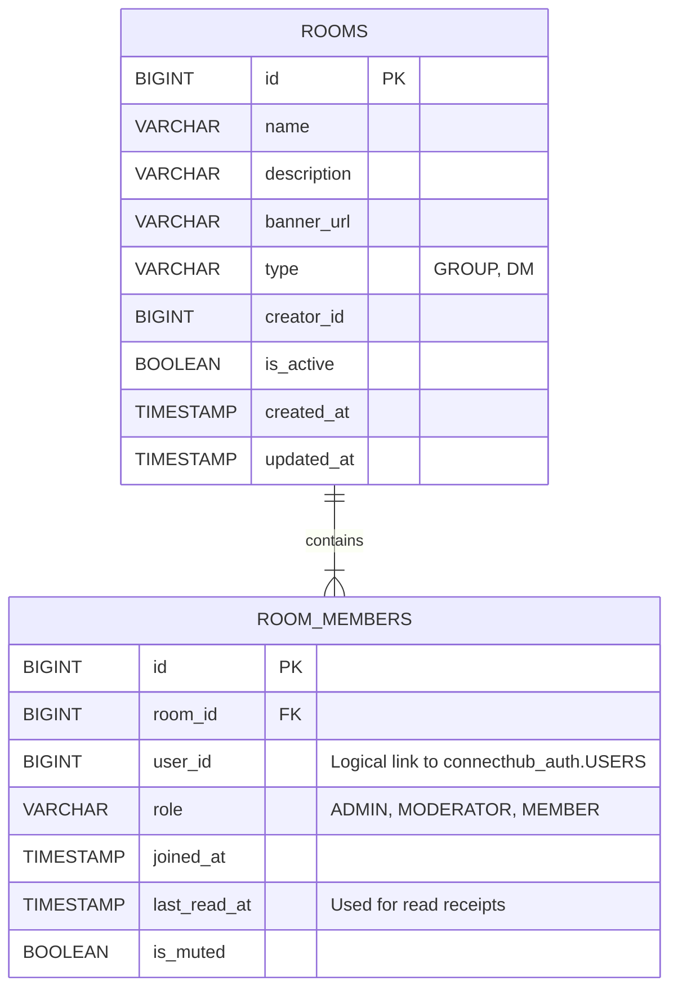
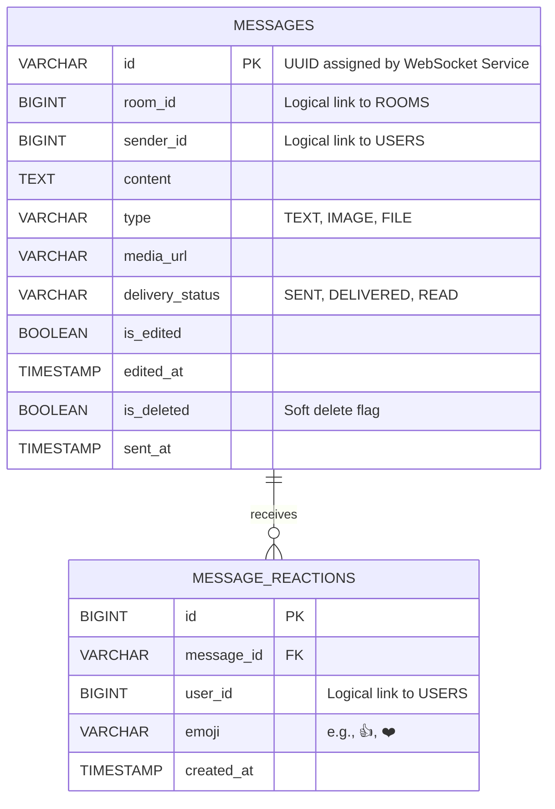
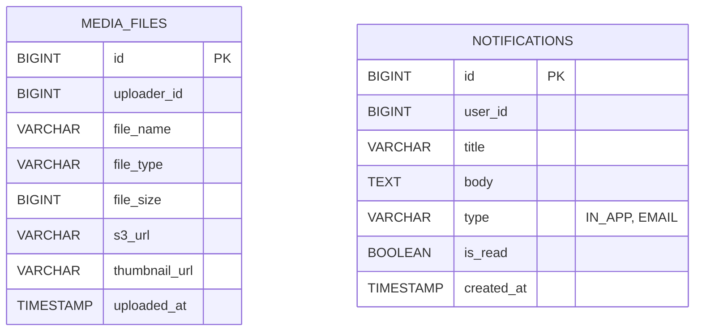

# ConnectHub Entity Relationship Diagrams

Due to the microservice architecture, each service operates its own independent database schema. The following diagrams represent the entities and their logical relationships separated by their respective bounded contexts.

## 1. Auth Service Database (`connecthub_auth`)

Stores user credentials, profiling, and manages audit logs.

## 2. Room Service Database (`connecthub_room`)

Handles groups, direct messages (DMs), and membership tracking.

## 3. Message Service Database (`connecthub_message`)

Manages message history, pagination contexts, and emoji reactions.

## 4. Media & Notification Service Databases

Databases tracking uploaded files and notification queues.

