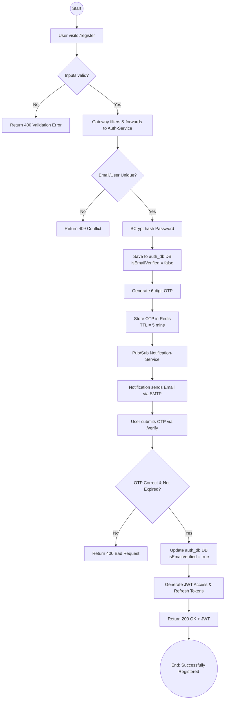
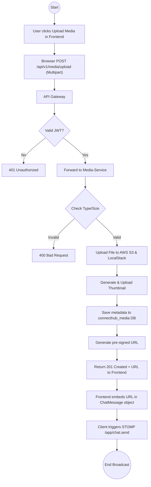
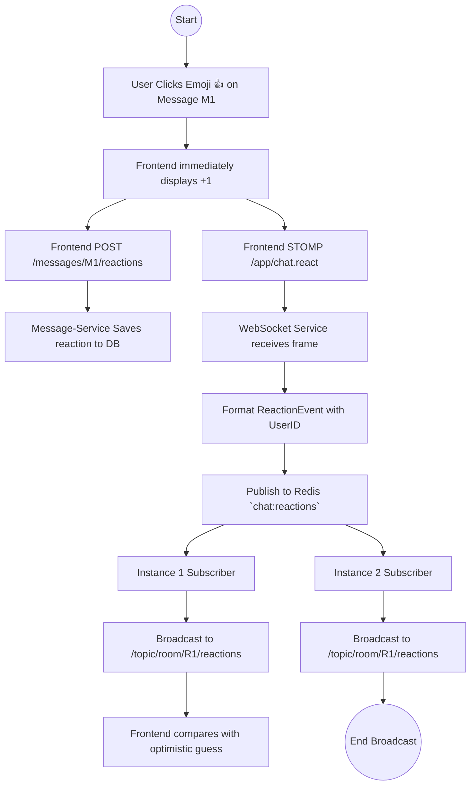

# ConnectHub Feature Flow Diagrams

These flow diagrams represent the end-to-end functionality flows of the core microservice features inside the ConnectHub backend.

## 1. Complete Registration and Authorization Flowchart

## 2. File Upload Flowchart

## 3. Emoji Reactions Pipeline Flowchart

