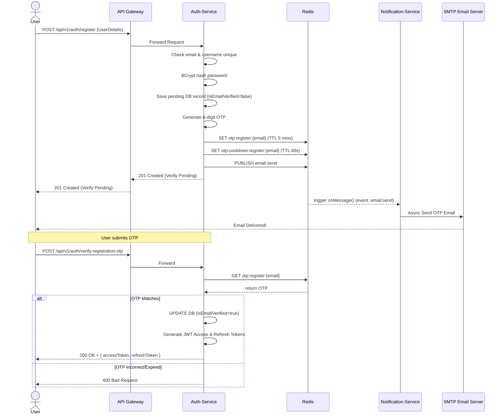
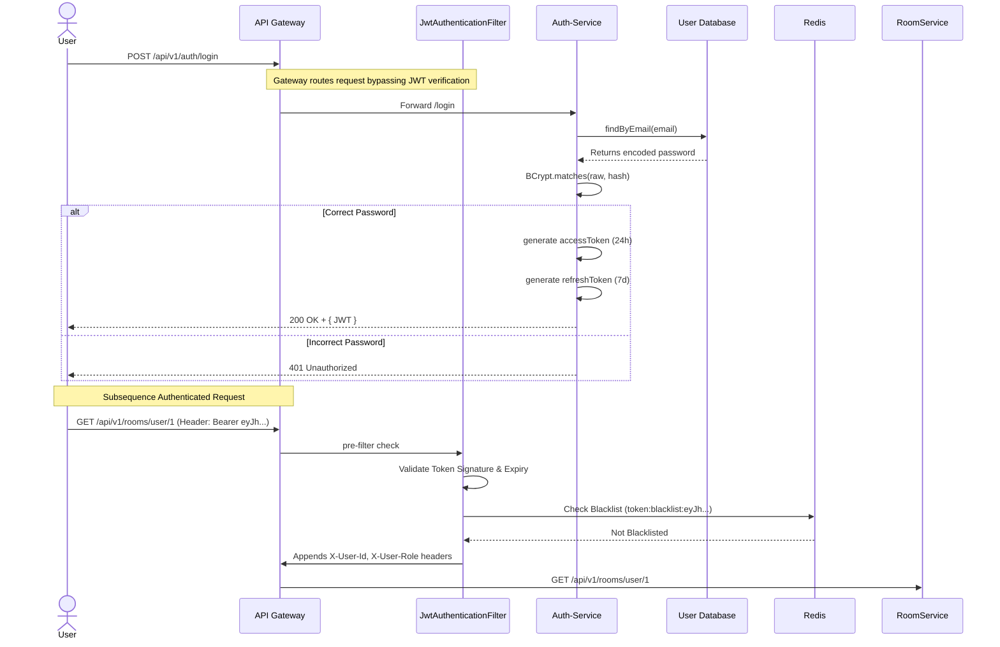
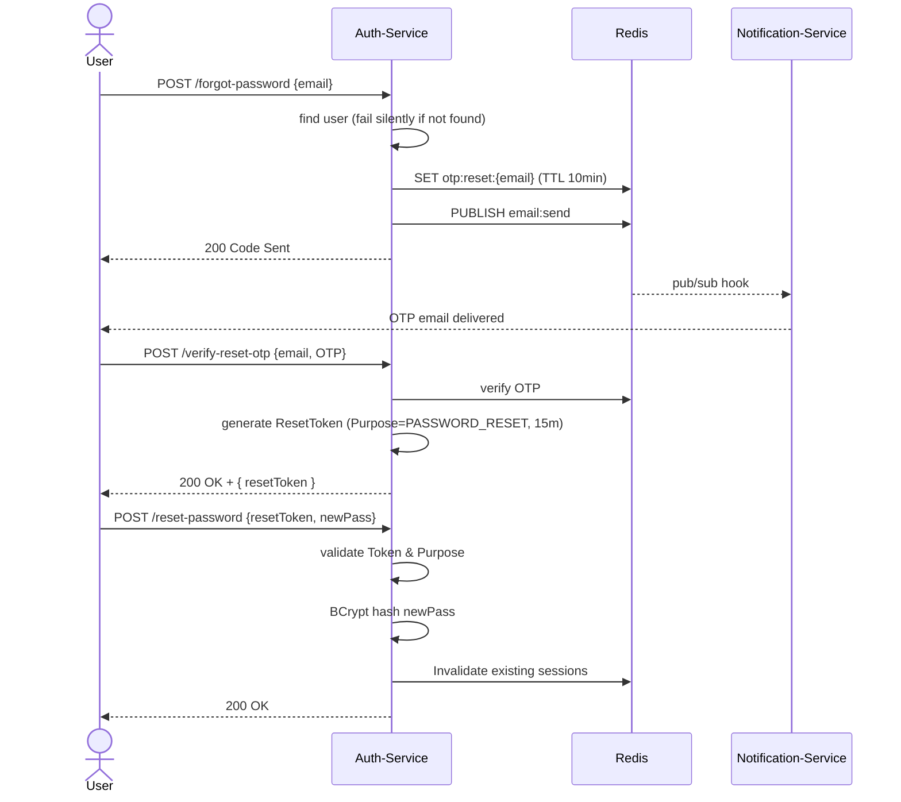

# Authentication & User Flow Diagrams

The diagrams below represent the standard sequence flows for user management processes happening via the ConnectHub Gateway.

## 1. User Registration Flow

## 2. Login Flow with JWT & Filtering

## 3. Forgot Password Flow

