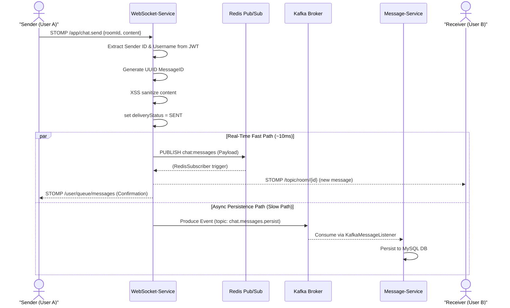
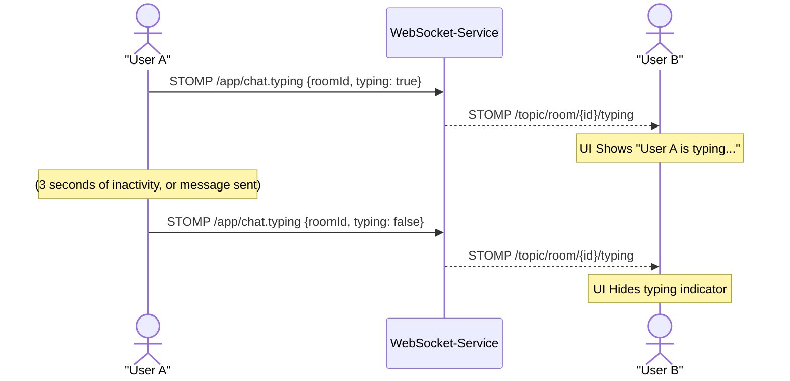
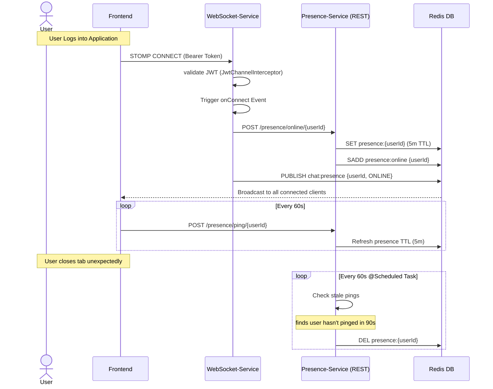
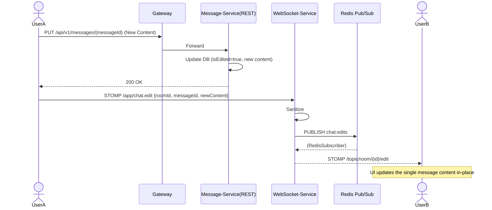

# Messaging and Real-Time Event Sequence Diagrams

These sequence diagrams display how STOMP Websockets, Redis Pub/Sub, and Async processing handle Chat functionality.

## 1. Chat Message Sending (Real-Time Fast Path vs Slow Path)

## 2. Typing Indicator Sequence

Typing events are ephemeral and loss-tolerant, so they broadcast locally within the scope of the room without Redis Pub/Sub fanout.

## 3. Presence Tracking System Workflow

## 4. Edit/Delete Distributed Workflow

